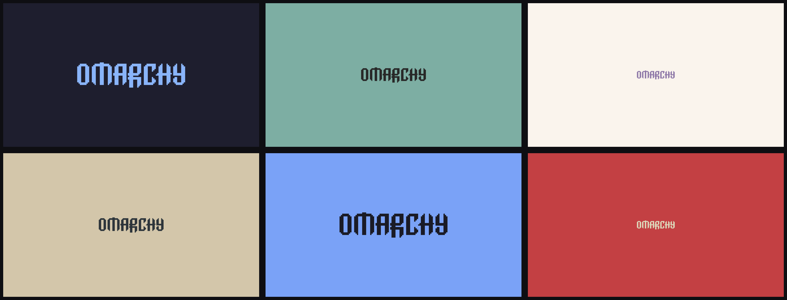

# Logomarchy

For theme hoppers who want to always be repping [Omarchy](https://omarchy.org/) on their desktop.

Plenty of themes don't ship their own take on the Omarchy logo wallpaper. Logomarchy makes one for every theme, in that theme's colors. Pick one of three logo sizes, try a few color combos, and set the one you like.



## Install

```bash
omarchy plugin add https://github.com/paytbidd/omarchy-logomarchy.git --enable
```

That's it. Once enabled, Logomarchy:

- Adds **Style › Logomarchy** to the Omarchy menu (Super+Space)
- Installs a `theme-set` hook, so every theme you switch to gets a logo wallpaper
- Makes one for the theme you're on right now

## Use

Switch themes as usual. If the new theme has no Omarchy logo wallpaper, you get one that looks like the stock ones: the theme's background with an accent-colored logo. It joins the theme's own wallpapers, so `omarchy theme bg next` cycles through it. If the theme has no wallpapers at all, the logo is set right away. Themes that already ship an Omarchy logo wallpaper are left alone.

To change the logo, open **Style › Logomarchy**:

- **Size:** Default, Small, or Extra small
- **Background:** a row of the theme's main colors, plus a row of its palette hues
- **Logo:** the same idea for the mark itself

Picks update the preview instantly. **Set as wallpaper** renders it (3840×2160) and puts it up. **Remove** takes it off this theme. Each theme remembers its own pick.

Colors come straight from the theme's `colors.toml`, and a color only shows up once, even if the theme uses it twice. Themes that only define terminal colors get their hues from `color1`–`color6`.

## What it changes

- `~/.config/omarchy/backgrounds/<theme>/omarchy-logo-*.png`: one generated wallpaper per theme, in the folder Omarchy already uses for extra wallpapers. Nothing inside a theme is modified.
- `~/.config/omarchy/hooks/theme-set.d/logomarchy`: the theme-set hook.
- `~/.config/omarchy/extensions/omarchy-menu.jsonc`: one `style.logomarchy` row between `>>> payton.logomarchy` / `<<< payton.logomarchy` comments. The rest of the file is left as is, and it's only written if the result still parses.

## Remove

```bash
omarchy plugin remove payton.logomarchy
```

Disabling or removing the plugin takes out the hook and the menu row. Generated wallpapers stay put in case one is on screen. To delete those too, run this first:

```bash
~/.config/omarchy/plugins/payton.logomarchy/scripts/omarchy-logomarchy teardown --purge
```

## CLI

```bash
omarchy-logomarchy generate [--theme <slug>] [--size default|small|xsmall] [--field <color>] [--logo <color>] [--set]
omarchy-logomarchy auto [<slug>]      # what the hook runs
omarchy-logomarchy remove [--theme <slug>]
omarchy-logomarchy get [--json]
omarchy-logomarchy panel
omarchy-logomarchy setup              # what the plugin runs when enabled
omarchy-logomarchy teardown [--purge]
```

The script lives at `~/.config/omarchy/plugins/payton.logomarchy/scripts/omarchy-logomarchy`.

Background colors: `dark`, `deep`, `muted`, `light`, `accent`. Logo colors: `accent`, `foreground`, `contrast`, `background`. Both also take `red`, `orange`, `yellow`, `green`, `cyan`, `blue`, `magenta`. Options the theme doesn't define are skipped.

## Requirements

`rsvg-convert`, `jq`, and `python3`, all included in Omarchy. The logo comes from Omarchy's own `logo.svg`.

## Tests

```bash
tests/logomarchy.test.sh
```

## License

[MIT](LICENSE)
